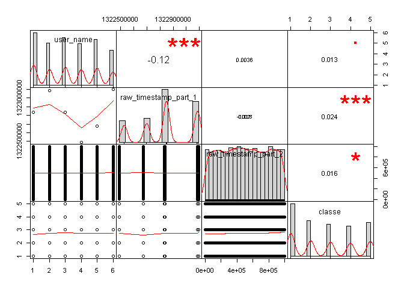
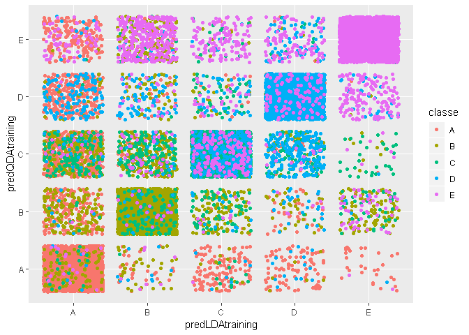

```r
knitr::opts_chunk$set(echo = TRUE)
```

##Session Information  
**Created:** Sun Jan 13 01:06:18 2019  
**Rstudio Version:** 1.1.453 <http://www.rstudio.com> 

# Load libraries

```r
library(ggplot2);library(dplyr);library(lubridate);library(caret);library(RANN);library(PerformanceAnalytics)
#library(MASS)
```
# Summary

* Linear and Quadratic Discriminant Analysis (**LDA, QDA**) models for classifying the form in which a dumbell lifting excercise were trained using data from instruments.A training data set for six individuals is available. The instruments were placed on the belt, forearm, arm, and dumbell. Five classes are defined for characterizing qualitative activity recognition.
* The original paper associated to this data:<http://web.archive.org/web/20170519033209/http://groupware.les.inf.puc-rio.br:80/public/papers/2013.Velloso.QAR-WLE.pdf>, used a bagged random forest approach that achieved 78.2% overall accuracy. This is a good benchmark for the model used here.
* Attempted fitting a model using the **treebag** method but aborted teh training as it was not converging. QDA is less of a "brute force" approach to implementing a classfier, and convergence is much faster. 
  
* Cross-validation is used to asses the generality of the model fit.  
* The expected out of sample error prediction for the model is calculated.  

# Load Dataset
Initial inspection of the dataframe summary (not shown here for brevity) reveals a large number of divide by zero entries. These are reassigned as NA entries before further cleanup of the data.

```r
na_strings<-c("#DIV/0!","NA")
training <- read.csv("https://d396qusza40orc.cloudfront.net/predmachlearn/pml-training.csv", na.strings=na_strings)
testing <- read.csv("https://d396qusza40orc.cloudfront.net/predmachlearn/pml-testing.csv", na.strings=na_strings)
```

##Data Cleanup
A few columns are reassigned apprporate classes as factors or POSIXct. Near zero variance columns that will contribute little to explaining the outcome are removed.

```r
trainingClean<-mutate(training, user_name=as.factor(user_name),classe=as.factor(classe),new_window=as.factor(new_window),cvtd_timestamp=dmy_hm(cvtd_timestamp))
testingClean<-mutate(testing,user_name=as.factor(user_name),new_window=as.factor(new_window),cvtd_timestamp=dmy_hm(cvtd_timestamp))
trainingClean <- trainingClean[,-nearZeroVar(trainingClean)] #remove columns with near zero variance in the TRAINING set.
```

# Exploratory Analysis
##Factors' representation in training data 

```r
table(trainingClean$user_name,trainingClean$classe)
```

```
##           
##               A    B    C    D    E
##   adelmo   1165  776  750  515  686
##   carlitos  834  690  493  486  609
##   charles   899  745  539  642  711
##   eurico    865  592  489  582  542
##   jeremy   1177  489  652  522  562
##   pedro     640  505  499  469  497
```

```r
cleanColumns<-dim(trainingClean)[2]
cleanRows<-dim(trainingClean)[1]
#testRows<-dim(testingClean)[1]
```
* Seems like the data is reasonably balanced among factors. Random sampling shuold be suitable for splitting the data for cross validation purposes.  
* It is not practical to look at correlation plots since there are 124 columns in the cleaned-up data. 

## Outcome correlation with Participant and Timestamp


```r
sub<-select(trainingClean, user_name,raw_timestamp_part_1,raw_timestamp_part_2,classe)
sub<-mutate(sub,user_name=as.integer(user_name), classe=as.integer(classe))
suppressWarnings(chart.Correlation(sub, histogram=TRUE, pch=19))
```

<!-- -->

* No apparent correlation exists between the outcome, participant, and the time stamp. However, the model should only use instrument motion data to classify the outcome. Therefore, the timestamp columns and participant factor should be excluded form the cleaned-up training set.  
* Since the cleaned up columns (except for factors and timestamps) are numerical, model-based linear classification methods  seem appropriate. These methods assume multivariate **Gaussian** parameters with same covariances (**LDA**) or different covariances(**QDA**). 
* To fulfill the Gaussian assumption **standardizing (center and scale) + BoxCox** preprocessing is used.  
* Since there is missing data in many columns, **nearest neighbors inpute** is used.
* Since we have a reasonably large size of well-balanced training cases (19622 rows), a **single cross-validation set** can be randomly sampled from it to **estimate out of sample error**. 


```r
set.seed(7986)

#Remove timestamp columns and participant factor
trainingPre<-select(trainingClean,-X,-user_name,-classe, -raw_timestamp_part_1,-raw_timestamp_part_2, -cvtd_timestamp)

#Create pre-processing object
#PreObj_StdBoxCox<-preProcess(trainingPre,method = c("center","scale","BoxCox", 'knnImpute'))
PreObj_StdBoxCox<-preProcess(trainingPre,method = c('knnImpute'))
#Preprocess
trainingPre <- predict(PreObj_StdBoxCox, newdata=trainingPre) #pre-processed parameters
trainingPre <-mutate(trainingPre, classe=training$classe) #restore outcome column
#Split data for cross-validation
#trainp<-0.75
#pcntCV<-(1-0.75)*100
#inTrain<-createDataPartition(trainingPre$classe,p=trainp,list=FALSE)
#training<-trainingPre[inTrain,]
#crossValidation<-trainingPre[-inTrain,]
#ARtraining<-dim(training)[1]/dim(training)[2]
ARtraining<-dim(trainingPre)[1]/dim(trainingPre)[2]


#* `r format(pcntCV,digits=0, nsmall=0)`% of the original training data is split for use as a cross-validation #set. No need for other resampling methods (e.g. k-fold) since the data set is not small. A judgement call is #made in favor of less variance (potentially larger prediction bias). 
#rm(trainingClean)
```
* We have over 10 times (165) more sample rows than predictor columns, as recommeded for the QDA covariance matrix to be invertible.

# Training
* Fitted a **LDA and QDA** models with preprocessing combining **center,scale, BoxCox, and PCA**. Training converged in less than a minute using a typical laptop PC.   
* Also tried training a model using the **treebag** method which did not converge within many minutes of runtime.
* Used 10 fold Cross-Validation resampling to assess the **out of sample error** and **kappa** metric.
* PCA is used to distill a regressor basis that captures most of the variance with optimum degrees of freedom.
* LDA expected performance is better but warnings of **collinearity** were present during the training. QDA converged with no warnings.
* 

## LDA Training

```r
#priorClasse<-c(1, 1, 1, 1, 1)/5 #Assume prior probabilities for excercise outcome (classe)
set.seed(342)

suppressWarnings(fitLDA<-train(classe~.,data=trainingPre,method="lda",preProcess=c("center","scale"),trControl = trainControl(method = "cv"))) #accuracy 0.7646 kappa 0.7023
print(fitLDA)
```

```
## Linear Discriminant Analysis 
## 
## 19622 samples
##   118 predictor
##     5 classes: 'A', 'B', 'C', 'D', 'E' 
## 
## Pre-processing: centered (118), scaled (118) 
## Resampling: Cross-Validated (10 fold) 
## Summary of sample sizes: 17658, 17660, 17659, 17660, 17659, 17660, ... 
## Resampling results:
## 
##   Accuracy  Kappa    
##   0.7646    0.7023307
```

```r
confusionMatrix(data=predict(fitLDA,trainingPre),reference=trainingPre$classe)
```

```
## Confusion Matrix and Statistics
## 
##           Reference
## Prediction    A    B    C    D    E
##          A 4799  432  163  163   95
##          B  147 2616  283  129  418
##          C  300  501 2748  444  336
##          D  297   96  134 2440  235
##          E   37  152   94   40 2523
## 
## Overall Statistics
##                                           
##                Accuracy : 0.7709          
##                  95% CI : (0.7649, 0.7767)
##     No Information Rate : 0.2844          
##     P-Value [Acc > NIR] : < 2.2e-16       
##                                           
##                   Kappa : 0.7102          
##  Mcnemar's Test P-Value : < 2.2e-16       
## 
## Statistics by Class:
## 
##                      Class: A Class: B Class: C Class: D Class: E
## Sensitivity            0.8600   0.6890   0.8030   0.7587   0.6995
## Specificity            0.9393   0.9383   0.9024   0.9536   0.9798
## Pos Pred Value         0.8491   0.7281   0.6348   0.7620   0.8865
## Neg Pred Value         0.9441   0.9263   0.9559   0.9527   0.9354
## Prevalence             0.2844   0.1935   0.1744   0.1639   0.1838
## Detection Rate         0.2446   0.1333   0.1400   0.1244   0.1286
## Detection Prevalence   0.2880   0.1831   0.2206   0.1632   0.1450
## Balanced Accuracy      0.8996   0.8136   0.8527   0.8561   0.8397
```

```r
predLDAtraining<-predict(fitLDA,trainingPre)
```

## QDA TRAINING

```r
fitQDA<-train(classe~.,data=trainingPre,method="qda",preProcess=c("center","scale","pca"),trControl = trainControl(method = "cv")) #accuracy 0.7498 kappa 0.6870
print(fitQDA)
```

```
## Quadratic Discriminant Analysis 
## 
## 19622 samples
##   118 predictor
##     5 classes: 'A', 'B', 'C', 'D', 'E' 
## 
## Pre-processing: centered (118), scaled (118), principal component
##  signal extraction (118) 
## Resampling: Cross-Validated (10 fold) 
## Summary of sample sizes: 17661, 17659, 17661, 17660, 17659, 17661, ... 
## Resampling results:
## 
##   Accuracy   Kappa    
##   0.7516054  0.6891852
```

```r
confusionMatrix(data=predict(fitQDA,trainingPre),reference=trainingPre$classe)
```

```
## Confusion Matrix and Statistics
## 
##           Reference
## Prediction    A    B    C    D    E
##          A 3911  150   28   35   26
##          B  275 2575  218   59   84
##          C  738  747 3039  616  250
##          D  439  126   69 2412  320
##          E  217  199   68   94 2927
## 
## Overall Statistics
##                                           
##                Accuracy : 0.7575          
##                  95% CI : (0.7515, 0.7635)
##     No Information Rate : 0.2844          
##     P-Value [Acc > NIR] : < 2.2e-16       
##                                           
##                   Kappa : 0.6966          
##  Mcnemar's Test P-Value : < 2.2e-16       
## 
## Statistics by Class:
## 
##                      Class: A Class: B Class: C Class: D Class: E
## Sensitivity            0.7009   0.6782   0.8881   0.7500   0.8115
## Specificity            0.9830   0.9598   0.8549   0.9419   0.9639
## Pos Pred Value         0.9424   0.8019   0.5638   0.7166   0.8351
## Neg Pred Value         0.8921   0.9255   0.9731   0.9505   0.9578
## Prevalence             0.2844   0.1935   0.1744   0.1639   0.1838
## Detection Rate         0.1993   0.1312   0.1549   0.1229   0.1492
## Detection Prevalence   0.2115   0.1636   0.2747   0.1715   0.1786
## Balanced Accuracy      0.8419   0.8190   0.8715   0.8459   0.8877
```

```r
predQDAtraining<-predict(fitQDA,trainingPre)
```

## Combined Model
The LDA and QDA predictions could be used in a combineed model for better acccuracy but the benefit will be marginal since the predictions are highly correlated (see plot below):

```r
qplot(predLDAtraining,predQDAtraining,colour=classe, data=trainingPre,geom="jitter")
```

<!-- -->

## Treebag Training (failed to converge)

```r
#fitTB<-train(classe~.,data=trainingPre,method="treebag",preProcess=c("center","scale","BoxCox","pca")) #failed to converge
```


